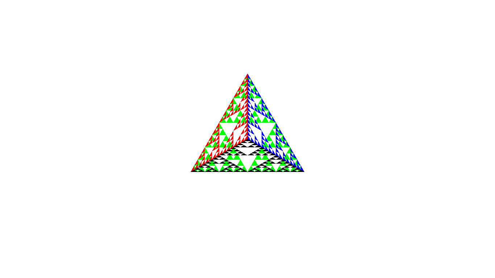

Problem Statement
=================

Program to recursively subdivide a tetrahedron to form 3D Sierpinski gasket. The number of recursive steps is to be specified by the user.


### Compilation

```
$ g++ sierpinski_gasket.cpp -lGL -lGLU -lglut 
$ ./a.out
Enter number of recursive steps 
4

```

### Output



