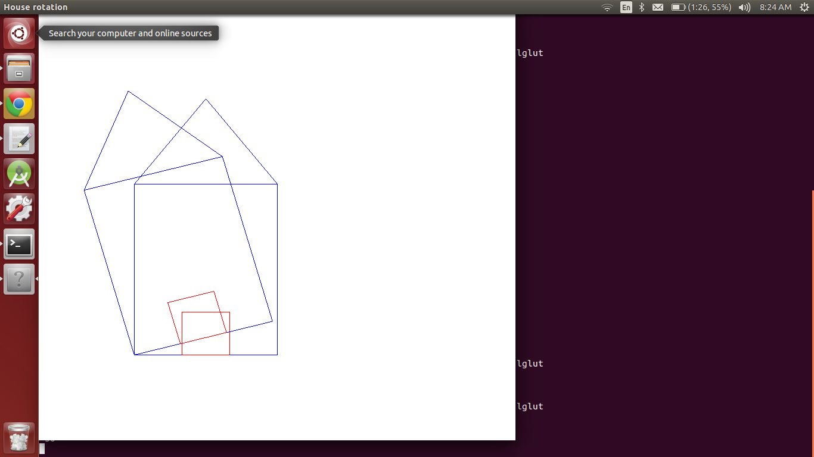

Problem Statement
=================

Program to create a house like figure and rotate it about a fixed point.


### Compilation

```
$ g++ rotate_house.cpp -lGL -lGLU -lglut
$ ./a.out 
Enter rotation angle 
-50

```

### Output



