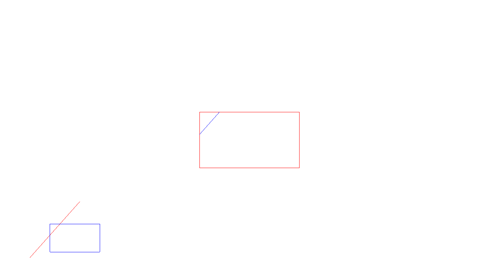

Problem Statement
=================

Program to implement Cohen Sutherland Line clipping algorithm.


### Compilation

```
$ g++ cohen_sutherland.cpp -lGL -lGLU -lglut
$ ./a.out 
Enter end points 
30 40
80 140


```

### Output



