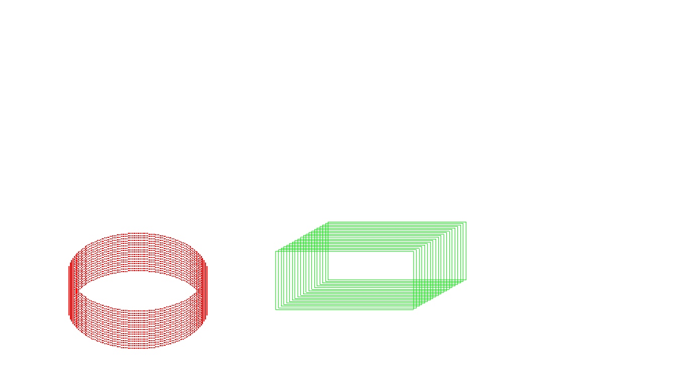

Problem Statement
=================

Program to create a cylinder and a parallelopiped by extruding a circle and quadrilateral respectively.


### Compilation

```
$ g++ cylinder_parallelopiped.cpp -lGL -lGLU -lglut
$ ./a.out

```

### Output



