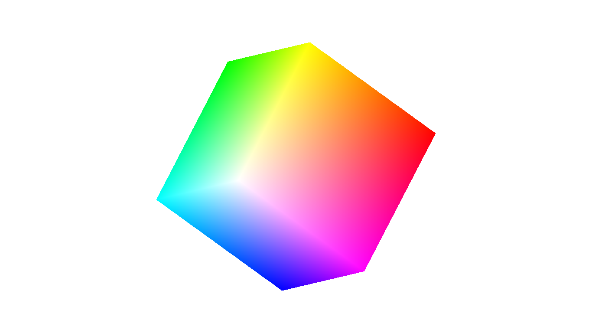

Problem Statement
=================

Program to draw a color cube and allow the user to move the camera suitably to experiment with perspective viweing.


### Compilation

```
$ g++ cube_move.cpp -lGL -lGLU -lglut 
$ ./a.out

```

### Output



