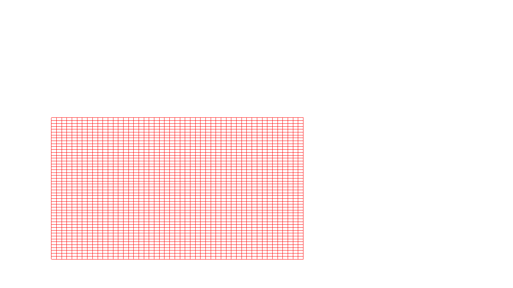

Problem Statement
=================

Program to display a set of values {fij} as a rectangular mesh.


### Compilation

```
$ g++ rectangular_mesh.cpp -lGL -lGLU -lglut
$ ./a.out

```

### Output



