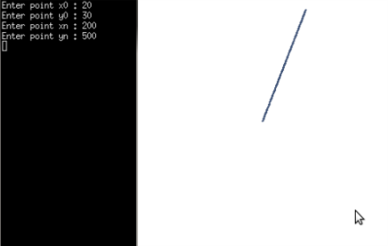
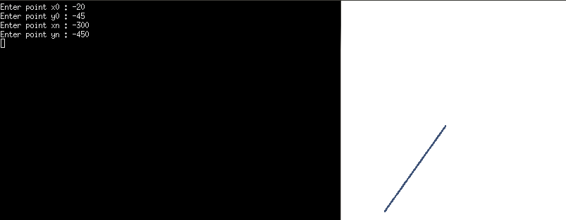

Problem Statement
=================

Program to draw a line between two points using bresenham's line drawing algorithm.


### Compilation

```
$ gcc bresenham.c -lGL -lGLU -lglut 
$ ./a.out

```

### Output




